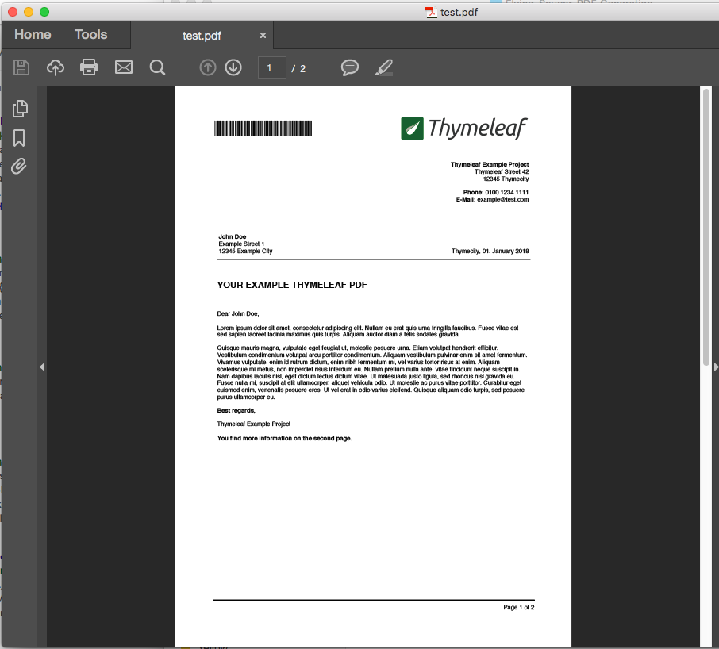

# Flying Saucer PDF Generation
------------------------------

This demo project shows how to generate a nicely styled PDF with Flying Saucer and Thymeleaf templates.

In order to generate the PDF run the JUnit test:

    src/test/FlyingSaucerTest.java
    
The test will generate a PDF called:

    test.pdf
    
A copy of the generated PDF is checked-in, in case you want to see what is generated:

    example_of_generated_pdf.pdf        

The project can be build with Gradle (using `build.gradle`) or Maven (using `pom.xml`).

